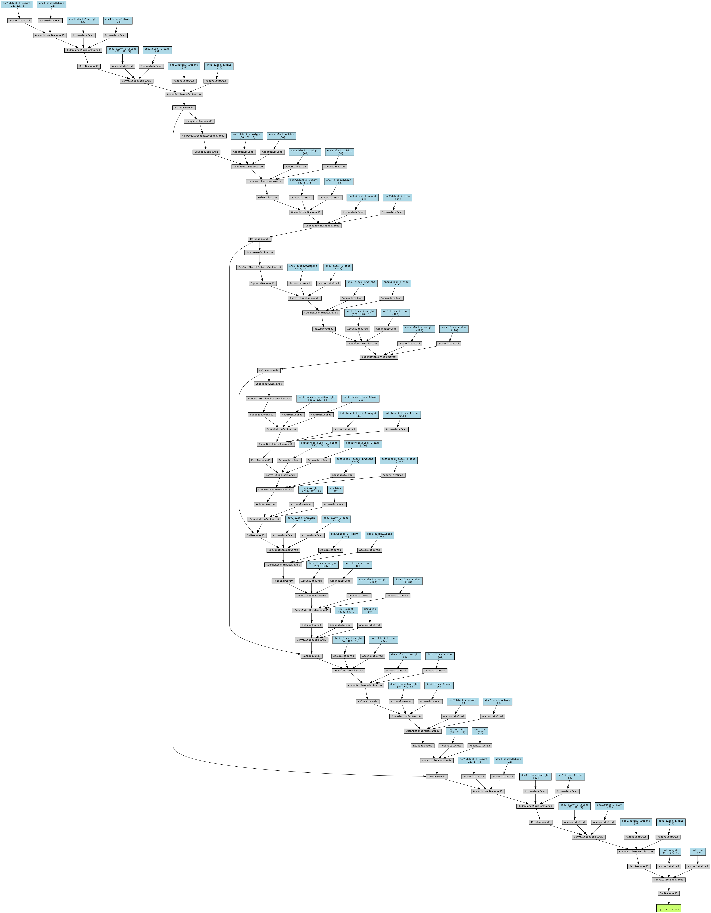
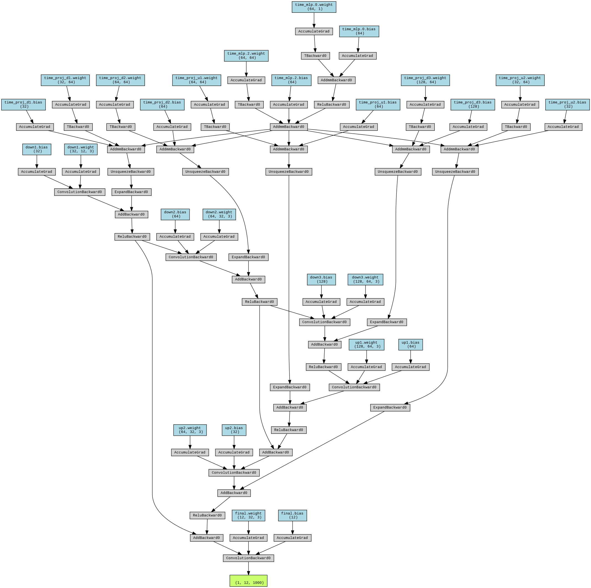

# ECG Denoising via Deep Learning: A Comparative Study

This repository benchmarks two neural denoising families for 12-lead ECG signals: convolutional denoising autoencoders (CDAE) and denoising diffusion probabilistic models (DDPM). The pipeline trains on PTB-XL and evaluates restoration quality with mean squared error (MSE) and SNR-based diagnostics.

## Scientific Context
ECG signals are frequently corrupted by baseline wander, power-line interference, and muscle artifacts. We model these perturbations to generate realistic noisy-clean pairs for supervised denoising. The study follows established practices in physiological signal processing and deep generative modeling.

## Dataset
- **PTB-XL**: a large public 12-lead ECG dataset with clinical annotations and standardized recording protocols.
- The data loader caches signals into `.npy` files for faster repeated experiments.

## Noise Model
We inject noise by mixing:
- Gaussian noise (broadband),
- baseline wander (low-frequency drift),
- power-line interference (50/60 Hz),
- muscle artifacts (bursty EMG-like noise).

Noise level is controlled by a target SNR range to simulate variable clinical acquisition conditions.

## Models
### 1) Convolutional Denoising Autoencoder (CDAE)
A symmetric encoder-decoder with 1D convolutions learns to map noisy inputs to clean ECGs. This variant uses residual learning in the U-Net-style architecture.



### 2) Denoising Diffusion Probabilistic Model (DDPM)
A diffusion model is trained to predict the noise at each diffusion step, enabling iterative restoration by a reverse diffusion process.



## Training Protocol
- Train/val/test split: 80/10/10, with fixed indices saved to disk for *reproducibility*.
- Optimizer: Adam with ReduceLROnPlateau scheduling.
- Regularization: early stopping based on validation loss.
- Metrics: MSE and others functions for optimization

## Experimental Approach (from `notebooks/train_models-comp.ipynb`)
The notebook follows a comparative, end-to-end workflow:
- environment setup (local/Colab compatibility),
- PTB-XL loading and noisy-clean pair generation,
- training/validation/testing split,
- Autoencoder training with early stopping and SNR tracking,
- Diffusion training with the same evaluation logic,
- final comparison via loss curves and denoising examples.

In practice, this notebook serves as the reference for the full experimentation logic before moving to script-based runs.

## Current Limitation: Diffusion Model Needs Further Refinement
Under the current configuration, the diffusion branch does not yet reach the same practical denoising quality as the autoencoder baseline. This should be interpreted as a model/protocol maturity issue rather than a limitation of diffusion methods in general.

Likely causes include:
- insufficient architecture tuning for 1D ECG signals,
- training objective/sampling schedule not yet optimized,
- mismatch between noise process used in training and ECG artifact structure,
- limited hyperparameter exploration (steps, beta schedule, loss weighting, conditioning).

## Priority Recommendations
1. **Most important:** leverage and adapt what is state-of-the-art in image denoising diffusion literature (training tricks, noise schedules, objective variants, sampler design), then transfer these ideas to 1D ECG.
2. Strengthen the current diffusion network (capacity, multi-scale blocks, temporal conditioning, residual/attention design for ECG).
3. Improve training protocol (longer training, tuned LR schedule, better validation strategy, ablation studies).

## Reproducibility
- Random seed fixed across PyTorch and NumPy.
- Split indices saved in `data/splits_seed42_v1.npz`.
- All training outputs (curves, examples, logs) saved under `results/`.

## Project Structure
- `models/`: PyTorch implementations of `ECGUNetDenoiser` and `DiffusionModel`.
- `notebooks/`: training and demo notebooks.
- `scripts/`: standalone training and evaluation scripts.
- `utils/`: data loading, training utilities, and shared experiment helpers.
- `data_setup.py`: PTB-XL download and cache build.
- `run_pipeline.py`: orchestrates the full pipeline with logging.

## Getting Started
Install dependencies:
```bash
pip install -r requirements.txt
```

Run the full pipeline:
```bash
python run_pipeline.py
```

Run individual steps:
```bash
python data_setup.py
python scripts/train_autoencoder.py
python scripts/train_diffusion.py
python scripts/evaluate.py
```

## References
1. Wagner, P., et al. "PTB-XL, a large publicly available electrocardiography dataset." *Scientific Data* (2020).
2. Goldberger, A. L., et al. "PhysioNet: Components of a new research resource for complex physiologic signals." *Circulation* (2000).
3. Vincent, P., et al. "Extracting and Composing Robust Features with Denoising Autoencoders." *ICML* (2008).
4. Ronneberger, O., et al. "U-Net: Convolutional Networks for Biomedical Image Segmentation." *MICCAI* (2015).
5. Sohl-Dickstein, J., et al. "Deep Unsupervised Learning using Nonequilibrium Thermodynamics." *ICML* (2015).
6. Ho, J., et al. "Denoising Diffusion Probabilistic Models." *NeurIPS* (2020).
7. Song, Y., et al. "Score-Based Generative Modeling through Stochastic Differential Equations." *ICLR* (2021).
